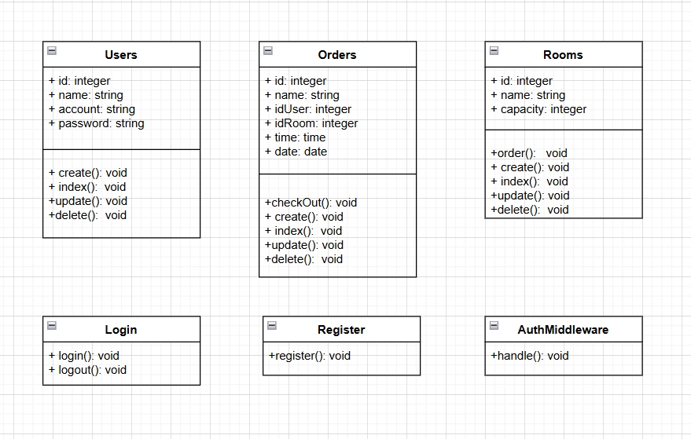
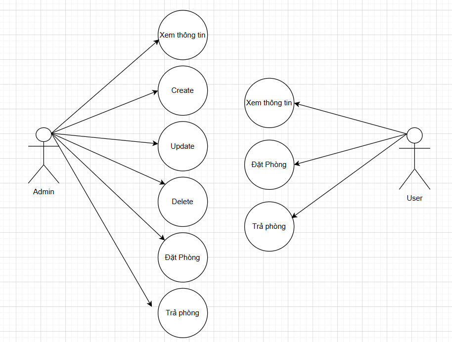

# Project: Music Room

---


---

## Deployment Guide(Local Development Environment)
1. Clone the Repository
```php
git clone https://github.com/LeDucLong123/laravel_1.git
```
```php
cd Music
```
2. Install Dependencies:
```php
composer install
```
3. Set Up Environment Variables:
```php
cp .env.example .env
```
```php
php artisan key:generate
```
4. Configure Database Settings:
- Correct configuration with the database on your local machine
5. Run Migrations and Seed the Database:
```php
php artisan migrate
```
6. Start the Local Development Server:
```php
php artisan serve
```
7. Access the Application:
- Access your website: http://localhost:8000

---

## UML - Class Diagram



---

## Use Case Diagram



---